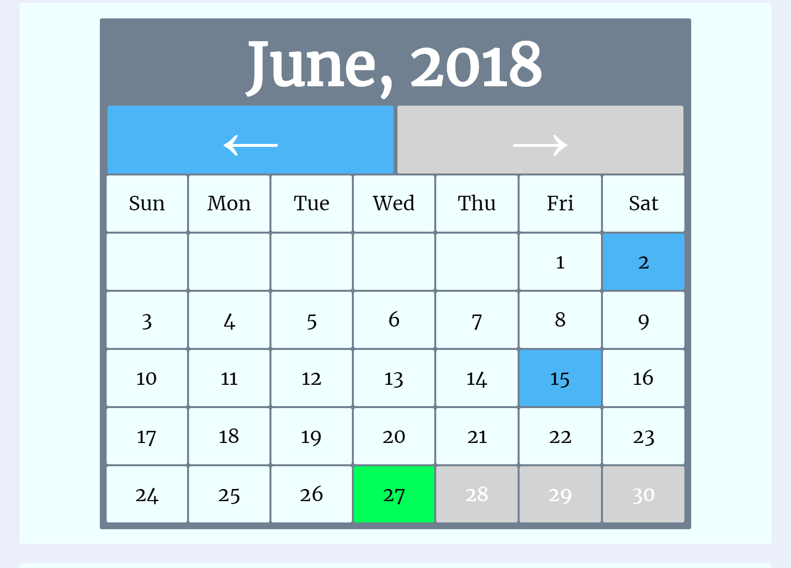

# Reflect Web App

The purpose of the 'Reflect' web app is to provide the user with a personal journal they can use to reflect upon their day. Each entry is recorded upon creation and can be accessed directly either through the calander or the 'Entries' section of the 'Home' page. The user is limited to one entry per day. Previous entries can be edited and deleted as needed.

Try it out, at https://cryptic-reaches-81198.herokuapp.com/

'Reflect' uses html, css, javascript, jquery, node.js, Express, and mongoDB.
